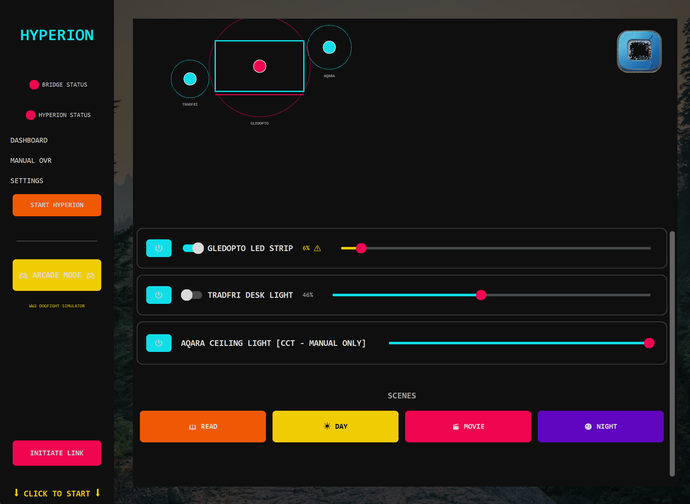

# Hyperion Zigbee Bridge & Command Center

A Vaporwave-styled dashboard and bridge to sync your Zigbee RGB lights (via Zigbee2MQTT) with Hyperion screen capture. Features real-time color synchronization, manual override controls, and a retro cyberpunk interface.



## What It Does

**Simple explanation:** This app automatically controls your smart lights to match colors from your screen. For example, if you're watching a movie with dark scenes, your lights get darker and match the movie's color palette. You can also manually control lights with a beautiful retro dashboard.

**Use cases:**
- 🎬 Sync room lighting with movies/games for immersive experience
- 📚 Ambient reading mode for focused work
- 🎮 Dynamic lighting that responds to screen content
- 🌙 Manual light control with preset scenes (Day, Night, Movie, Read)
- ☀️ Smart warmth adjustments (shift to orange/red for cozy ambiance)

**Compatible with:** Windows, Linux, macOS (requires Python 3.10+, Hyperion.NG, Zigbee2MQTT)

## Features

- **🎨 Real-time Color Sync:** Automatically syncs Zigbee RGB lights with your screen content via Hyperion.NG ambient color capture
- **🔥 Deep Warmth Mode:** Intelligent color-shifting algorithm that transitions colors to deep orange/red tones for a cozy, warm atmosphere
- **🎛️ Hybrid Light Control:** Toggle individual lights between automatic sync and manual control modes
- **💡 Per-Light Brightness Control:** Adjust brightness multipliers for each light (0-100%, hardware max override)
- **🌈 Manual Override:** Full manual control when needed - set custom RGB colors, color temperature (CCT), or brightness
- **⚡ Preset Scenes:** Quick-access scene buttons (READ, DAY, MOVIE, NIGHT) with pre-configured color profiles
- **🎮 Vaporwave Dashboard:** Custom retro cyberpunk UI built with CustomTkinter featuring cyan/pink neon styling
- **📊 Real-time Status:** Visual indicators for bridge and Hyperion connection status
- **⚙️ Configurable Throttling:** Adjust color update frequency to balance responsiveness vs. MQTT load

## Prerequisites

- **Hyperion.NG** (v0.13+) - Ambient lighting capture tool running on port 8090
- **Zigbee2MQTT** - Zigbee device bridge with Mosquitto MQTT broker on port 1883
- **Python 3.10+** - For running the dashboard and bridge
- **Zigbee RGB/CCT Lights** - Compatible devices (tested with Gledopto, Tradfri, Aqara)

> 💡 **New users:** See [Platform-Specific Setup](#platform-specific-setup) at the bottom for detailed installation instructions for your OS.

## Installation

1. Clone the repository:
   ```bash
   git clone https://github.com/jackbelmore/Hyperion-Zigbee-Bridge.git
   cd Hyperion-Zigbee-Bridge
   ```

2. Install Python dependencies:
   ```bash
   pip install -r requirements.txt
   ```

3. Configure your setup:
   ```bash
   cp bridge_config.example.json bridge_config.json
   ```
   Edit `bridge_config.json` with your:
   - Zigbee2MQTT device topics
   - Hyperion WebSocket URL (default: ws://127.0.0.1:8090/json-rpc)
   - MQTT broker address and credentials (if needed)

## Quick Start

**Windows (Easiest):**
```bash
Double-click launch_hyperion.bat
```

**Command Line (All Platforms):**
```bash
python hyperion_command_center.py
```

> 💡 **First time?** You'll need to install prerequisites first. See [Platform-Specific Setup](#platform-specific-setup) below.

### Dashboard Layout

**Left Sidebar:**
- **BRIDGE STATUS** - Connection status to Zigbee2MQTT
- **HYPERION STATUS** - Connection status to Hyperion.NG
- **Navigation Menu** - Dashboard, Manual Override, Settings
- **Arcade Mode** - Activates preset scene buttons
- **Initiate Link** - Manual device linking (if needed)

**Main Area - Light Control:**
- **Sync Toggle** - Enable/disable automatic color sync per light
- **Brightness Slider** - Adjust max brightness during sync mode
- **Brightness ⚠️ Badge** - Shows if light is at hardware max
- **Manual Color Control** - When light is disabled from sync (if applicable)

**Preset Scenes (Bottom):**
Quick-access buttons for pre-configured lighting scenes (READ, DAY, MOVIE, NIGHT)

### Configuration

Edit `bridge_config.json` to customize:

```json
{
    "hyperion_url": "ws://127.0.0.1:8090/json-rpc",
    "mqtt_broker": "127.0.0.1",
    "mqtt_port": 1883,
    "throttle_interval": 0.6,
    "color_warmth": 3.0,
    "devices": [
        {
            "name": "Desk Light",
            "topic": "zigbee2mqtt/Desk/set",
            "brightness_multiplier": 0.8,
            "type": "rgb"
        }
    ]
}
```

**Configuration Options:**
- `throttle_interval` - Seconds between color updates (lower = more responsive, higher = less MQTT traffic)
- `color_warmth` - Intensity of deep warmth mode (0.0 = off, 5.0+ = very warm)
- `brightness_multiplier` - Max brightness for this light (1.0 = 100%, 0.5 = 50%, -1 = hardware max)
- `type` - Light type: `rgb` (full color) or `cct` (color temperature only)

For issues, feature requests, or questions, please open an issue on GitHub.

## License

MIT License - See LICENSE file for details.

---

## Platform-Specific Setup

### Windows PowerShell Setup

Run these commands in PowerShell to set up Hyperion, MQTT broker, and the application:

```powershell
# 1. Download and install Hyperion.NG
Write-Host "Downloading Hyperion.NG..."
$hyperionUrl = "https://github.com/hyperion-project/hyperion.ng/releases/download/2.0.14/Hyperion-2.0.14-Windows-installer.exe"
$hyperionPath = "$env:TEMP\Hyperion-installer.exe"
Invoke-WebRequest -Uri $hyperionUrl -OutFile $hyperionPath
Start-Process -FilePath $hyperionPath -Wait
Remove-Item $hyperionPath

# 2. Download and install Mosquitto (MQTT Broker)
Write-Host "Downloading Mosquitto..."
$mosquittoUrl = "https://mosquitto.org/files/binary/win64/mosquitto-2.0.18-install-windows-x64.exe"
$mosquittoPath = "$env:TEMP\mosquitto-installer.exe"
Invoke-WebRequest -Uri $mosquittoUrl -OutFile $mosquittoPath
Start-Process -FilePath $mosquittoPath -Wait
Remove-Item $mosquittoPath

# 3. Install Python dependencies
Write-Host "Installing Python dependencies..."
pip install -r requirements.txt

# 4. Setup configuration
Write-Host "Creating configuration file..."
Copy-Item "bridge_config.example.json" "bridge_config.json"
Write-Host "Edit bridge_config.json with your Zigbee device topics, then run: python hyperion_command_center.py"
```

### Linux Bash Setup

Run these commands in Bash to set up Hyperion, MQTT broker, and the application:

```bash
#!/bin/bash

# 1. Update package manager
echo "Updating package manager..."
sudo apt-get update && sudo apt-get upgrade -y

# 2. Install dependencies
echo "Installing dependencies..."
sudo apt-get install -y python3 python3-pip git

# 3. Install Mosquitto (MQTT Broker)
echo "Installing Mosquitto..."
sudo apt-get install -y mosquitto mosquitto-clients
sudo systemctl enable mosquitto
sudo systemctl start mosquitto

# 4. Install Hyperion.NG from source or pre-built
echo "Installing Hyperion.NG..."
# Option A: Using pre-built binaries (recommended)
sudo apt-get install -y hyperion

# Option B: Build from source (if pre-built not available)
# git clone https://github.com/hyperion-project/hyperion.ng.git
# cd hyperion.ng && mkdir build && cd build && cmake .. && make && sudo make install

# 5. Clone and setup Hyperion-Zigbee-Bridge
echo "Setting up Hyperion-Zigbee-Bridge..."
git clone https://github.com/jackbelmore/Hyperion-Zigbee-Bridge.git
cd Hyperion-Zigbee-Bridge

# 6. Install Python dependencies
echo "Installing Python dependencies..."
pip3 install -r requirements.txt

# 7. Setup configuration
echo "Creating configuration file..."
cp bridge_config.example.json bridge_config.json
echo "Edit bridge_config.json with your Zigbee device topics, then run: python3 hyperion_command_center.py"

# 8. Verify MQTT and Hyperion are running
echo ""
echo "✓ Setup complete! Verify services are running:"
echo "  - MQTT Broker: mosquitto-pub -h localhost -t 'test' -m 'hello'"
echo "  - Hyperion: Check http://localhost:8090 (web UI)"
echo "  - App: python3 hyperion_command_center.py"
```

### macOS Setup

The setup for macOS is similar to Linux, using Homebrew:

```bash
#!/bin/bash

# 1. Install Homebrew (if not already installed)
/bin/bash -c "$(curl -fsSL https://raw.githubusercontent.com/Homebrew/install/HEAD/install.sh)"

# 2. Install dependencies
brew install python3 mosquitto hyperion

# 3. Start Mosquitto
brew services start mosquitto

# 4. Clone and setup Hyperion-Zigbee-Bridge
git clone https://github.com/jackbelmore/Hyperion-Zigbee-Bridge.git
cd Hyperion-Zigbee-Bridge

# 5. Install Python dependencies
pip3 install -r requirements.txt

# 6. Setup configuration
cp bridge_config.example.json bridge_config.json
echo "Edit bridge_config.json with your Zigbee device topics, then run: python3 hyperion_command_center.py"
```

---

## Support

